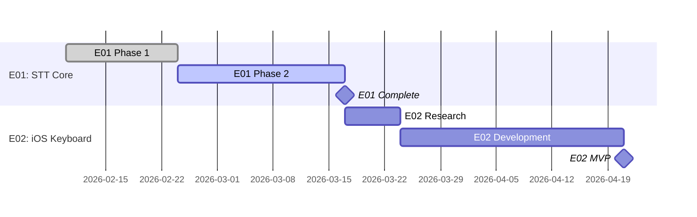

# Timeline Conventions

## Two Gantt Levels

1. **Project-level** (`docs/timeline.md`) — Epics as sections, milestones
2. **Epic-level** (`epics/{epic-id}/timeline.md`) — All tasks within the epic

## Mermaid Gantt Syntax

```mermaid
gantt
    dateFormat YYYY-MM-DD
    axisFormat %Y-%m-%d
    tickInterval 1week
    todayMarker stroke-width:3px,stroke:#f00

    section {Epic Title}
    {Task ID}-{ROLE} {Task title}  :{tags}, {id}, {start/after}, {duration}
```

## Tag Mapping from Task Status

| Task Status | Mermaid Tag |
|-------------|-------------|
| done | `done` |
| in_progress | `active` |
| blocked | `crit` |
| planned | (no tag) |
| backlog | (not shown) |

## Rules

- Task ID in Gantt MUST match task.md ID
- `after` keyword reflects `depends_on` from task frontmatter
- Milestones mark epic completion: `{Epic} Complete :milestone, after {last-task}, 0d`
- Generated by PROJ or CONS role
- Regenerated after task status changes via `ago:timeline` command
- Obsidian renders Mermaid natively

## Project-Level Example


